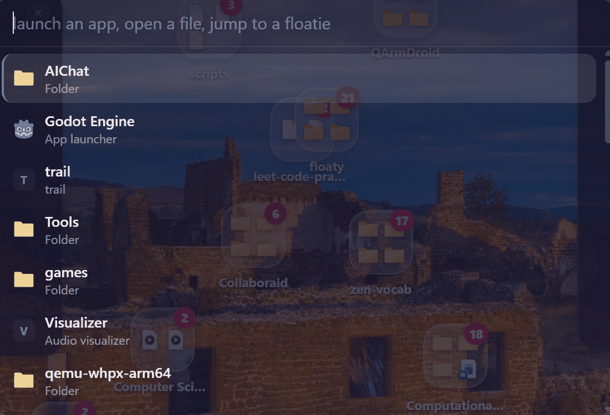
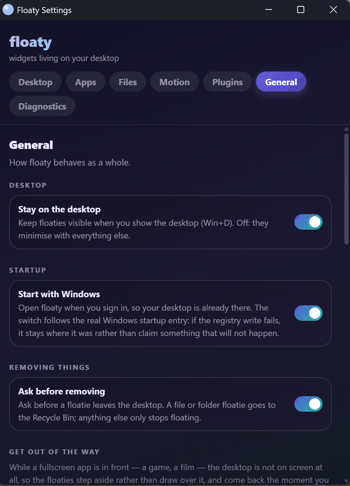

# Floaty

Your Windows desktop, but the icons float.

Floaty takes a folder — normally your real Desktop folder — and turns what is in it
into objects that fall, bounce and pile up on the wallpaper. Shortcuts launch apps,
documents are file icons, subfolders are folders, and dragging one file onto another
really moves it on disk. Sticky notes, a pomodoro clock, a Live2D
companion, an audio visualizer and a system monitor float in the same space.


## What it is, in plain words

**Your folder is the desktop.** Point Floaty at a folder and everything inside it
becomes a floatie. It watches the folder, so a file you add, rename or delete in
Explorer shows up, moves or vanishes on the desktop straight away. There is no sync
button, because there is nothing to sync — the desktop *is* the folder.

**The files are real.** When you drop one floatie onto another they become a folder,
and the files genuinely move into it on disk. Removing a file floatie sends it to the
Recycle Bin. Nothing is a mock-up, and nothing is copied anywhere.

**Gravity is the interaction.** Icons fall and settle on the floor of the screen.
Drag one and it lands where you let go. Drop it squarely on a second icon and the two
arm a merge preview first, the way Android shows the folder you are about to make.

**Widgets live there too.** The same physics, the same settings, one right-click from
pin-on-top — see [Widgets, plugins and settings](docs/WIDGETS.md).

**One overlay per screen.** Floaties can live on a second monitor and be dragged
between monitors mid-drag, each screen rendering at its own scale factor. See
[How Floaty thinks](docs/CONCEPTS.md).

**A launcher and a log.** `Ctrl+Alt+Space` opens a search palette on the screen your
pointer is on, and **Settings → Diagnostics** shows the log tail, the monitor
inventory and where every window actually is — when something looks wrong, that pane
is the bug report.



## Try it

```bash
npm install
npm run tauri dev
```

The first run asks which folder to use as your desktop — your real Desktop is the
usual answer, and you can change it later in **Settings → General**. Everything
Floaty stores lives in `%APPDATA%\com.floaty.app\`; the log is
`%APPDATA%\com.floaty.app\floaty.log`, and it rotates rather than being wiped.

To build an installer instead, see [Working on Floaty](docs/DEVELOPING.md).

## What is under the hood

A Rust + Tauri v2 backend that owns the windows, the file watching and the disk
operations, and a plain-DOM TypeScript frontend (Vite) that draws the widgets. No UI
framework: each widget builds its own DOM and throws the tree away when it
re-renders. Everything on screen is one full-screen transparent overlay window per
monitor, so the GPU cost tracks the overlay, not the number of widgets.

| I want to... | Read |
| --- | --- |
| understand why it behaves the way it does | [How Floaty thinks](docs/CONCEPTS.md) |
| use or write a widget | [Widgets, plugins and settings](docs/WIDGETS.md) |
| build it, run it, check it | [Working on Floaty](docs/DEVELOPING.md) |
| write a plugin | [docs/PLUGINS.md](docs/PLUGINS.md) |
| publish a version | [Shipping a release](docs/RELEASING.md) |



## Known limits and honesty

Floaty is Windows-only and built with heavy AI assistance; both are stated plainly in
[Working on Floaty](docs/DEVELOPING.md#built-with-ai), along with the list of things
it does not do yet.

## License

See [License](docs/DEVELOPING.md#license).
