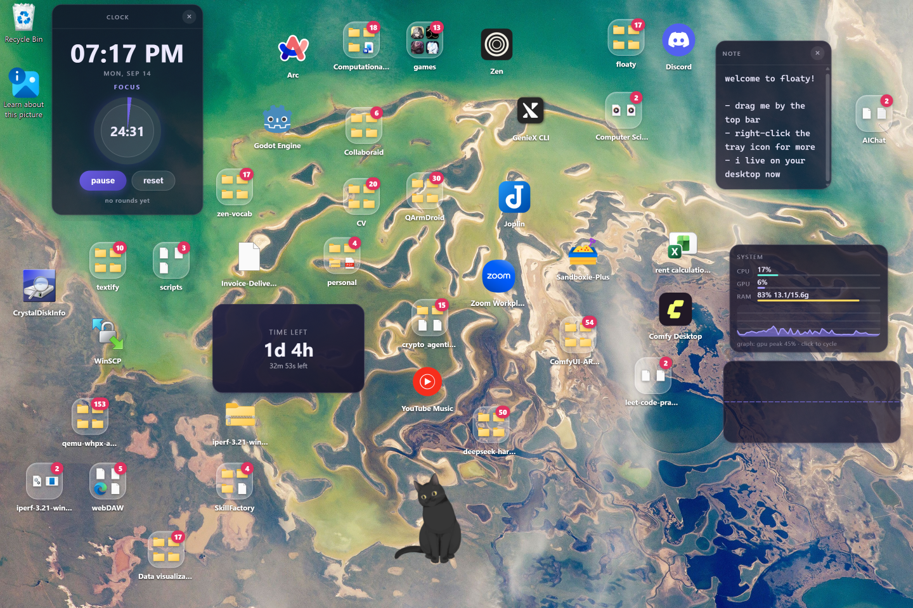

# Floaty

Gravity widgets for the Windows desktop. Your shortcuts, files and folders float
on the wallpaper and pile up under real physics, next to sticky notes, a pomodoro
clock, a wandering pet, a Live2D companion, an audio visualizer and a system
monitor.

Rust + Tauri v2 backend, plain-DOM TypeScript frontend (Vite). No UI framework:
each widget builds its own DOM and throws the tree away when it re-renders.



## What it does

**Your desktop, floated.** Point Floaty at a folder — usually your real Desktop —
and its contents become floaties: shortcuts become app launchers, documents
become file icons, subfolders become folder icons. The folder is watched, so a
file added, renamed or deleted on disk (by you, in Explorer, or by a cloud-synced
folder) appears, moves or disappears on the desktop while the app runs. There is
no sync button to press.

**Gravity.** Icons fall, bounce and come to rest on the wallpaper. Drag one and
it lands where you let go; drop it onto another icon and it lands on top of it.
Drop it squarely onto a second icon and the two arm a merge preview — the
Android-style shrink that shows the folder they are about to become.

**Real files, not a mock-up.** Grouping writes to disk: the files really move into
the new folder inside your root, and an app becomes a shortcut in it instead of
having its program moved. Dragging an item out of a folder moves it out on disk
too. Removing a file or folder floatie sends it to the Recycle Bin; removing
anything else just stops it floating.

**Widgets that live with them.** Notes, clock with pomodoro, pet, Live2D model,
system audio visualizer, CPU/GPU/RAM monitor — the same overlay, the same motion
settings, one right-click from pin-on-top.

**Every screen.** The desktop is the union of your monitors, so floaties can live
on the second one and be dragged between them, each resting on the floor of the
screen it is over. (Mixed scale factors are the exception — see **Known limits**.)

**A launcher.** `Ctrl+Alt+Space` (or whatever you set in General) opens the palette
on the screen your pointer is on: type, arrow, Enter. It searches your applications,
the root folder and your floaties together, resolving most-typed-first, and it is a
command line as much as a launcher — Enter on a widget floatie opens what a
double-click would.

**A log worth reading, and a pane that reads it.** `floaty.log` rotates (1MB × 3)
instead of being wiped at 100KB, and **Settings → Diagnostics** shows the tail of it
alongside the monitor inventory, where each window actually is, the heartbeat table
and the sizes on disk. When something looks wrong, that pane is the bug report.

## Requirements

- Windows 10 or 11 (Win32 shell, Recycle Bin and WASAPI loopback are used
  directly). Windows 10 needs the WebView2 runtime; Windows 11 ships it.
- Rust (stable) and Node 18+ for building from source.

## Building

### Development

```powershell
npm install
npm run tauri dev
```

`tauri dev` starts Vite on `http://localhost:1420` and a debug build that loads its
pages from it, so the frontend reloads as you edit while the Rust side is
recompiled and the app restarted when that changes. Two environment harnesses help
when reproducing something:

```powershell
$env:FLOATY_OPEN_SETTINGS=1   # open the settings window on boot
$env:FLOATY_DEMO=1            # float a few sample apps, a clock and the pet
```

Two things worth knowing before they cost you an afternoon:

- A running app locks its own executable, so `cargo build` (and the link step of
  `cargo test`) fails with `Access is denied` until you quit Floaty. The dev tree
  rebuilds by itself, so close the app when you want to build or test by hand.
- A debug build expects that dev server: launch it with nothing listening on
  `:1420` and the windows come up empty.

### Release

```powershell
npm run tauri build
```

The release build runs the frontend checks first (the same `npm run build`: plugin
ids, `tsc`, Vite), then compiles in release and bundles whatever `bundle.targets`
in `tauri.conf.json` asks for — `"all"` here, which on Windows means both
installers:

| Output | What it is |
| --- | --- |
| `src-tauri\target\release\bundle\nsis\Floaty_<version>_x64-setup.exe` | NSIS installer |
| `src-tauri\target\release\bundle\msi\Floaty_<version>_x64_en-US.msi` | WiX (MSI) installer |
| `src-tauri\target\release\floaty.exe` | the application on its own |

The first build needs network and some patience: Tauri downloads the WiX and NSIS
toolchains and every crate compiles from scratch. Later builds reuse `target/`.
Windows only, and nothing is signed unless you sign it.

Both architectures build from the same command with a target:

| Target | What it is |
| --- | --- |
| `x86_64-pc-windows-msvc` | Intel and AMD — what you get by default |
| `aarch64-pc-windows-msvc` | Windows on ARM |

```powershell
rustup target add aarch64-pc-windows-msvc
npm run tauri build -- --target aarch64-pc-windows-msvc --bundles nsis
```

ARM64 is NSIS only: the WiX path for arm64 is not worth relying on, and the installer
this project points people at is the NSIS one. The ARM64 MSVC toolset is part of a
normal Visual Studio install with the C++ workload.

One trap worth knowing before it bites: `tauri::generate_context!()` reads
`frontendDist` *while the crate compiles*, so a Rust step with no frontend build behind
it panics — `cargo test` and `cargo check` included:

```
error: proc macro panicked
    --> src\lib.rs:5702:16
    = help: message: The `frontendDist` configuration is set to `"../dist"` but this path doesn't exist
```

Run `npm run build` first, or let `npm run tauri build` do it — that is what its
`beforeBuildCommand` is for.

### Signing

Builds are unsigned: Windows has no certificate to check, so the first run gets
SmartScreen's "Windows protected your PC" (*More info* → *Run anyway*) and the
installer's publisher shows as unknown. That is a certificate, not a code change —
with one in the machine's certificate store, Tauri signs both the executable and
the installers through `signtool`. In `src-tauri/tauri.conf.json`:

```json
"bundle": {
  "windows": {
    "digestAlgorithm": "sha256",
    "certificateThumbprint": "<thumbprint of your certificate>",
    "timestampUrl": "http://timestamp.digicert.com"
  }
}
```

Use `signCommand` (with a `%1` placeholder for the binary) for any other signing
tool. The thumbprint is per-machine, which is why this repository carries none.

## Checks

```powershell
npm run build              # plugin id check + tsc --noEmit + vite build
npm run check:plugins      # only the backend/frontend plugin id agreement
cargo test                 # 80 backend tests, run from src-tauri
cargo check
npm run verify:panes       # render every settings pane headlessly (needs npm run dev)
npm run verify:app         # check the running app over its debug port
```

`verify/` holds the probes for the two halves `cargo test` cannot reach: the pages,
and the running app. They need no dependencies and they talk to the real thing — the
pane probe drives the real pane code with the IPC stubbed, the app probe drives the
real store through the real IPC. [verify/README.md](verify/README.md) says what each
one catches and the four rules for writing another.

The backend tests cover the watcher, the shortcut and grouping rules, the plugin
manifests, the icon store (including a real recycle-and-restore round trip), undo
steps and the disk moves they reverse, the desktop-layer window policy and how an
older settings file loads.
`scripts/check-plugins.mjs` fails the build when the plugin listed in the backend
registry and the one registered in the frontend disagree, which is the one mistake
that is easy to make and invisible at runtime. (Quit Floaty first: the running app
locks the executable the test link step needs.)

## Releasing

A tag is the release. Write the version down once, tag it, push:

```powershell
node scripts/set-version.mjs 0.2.0   # tauri.conf.json, Cargo.toml, package.json
git commit -am "release 0.2.0"
git tag v0.2.0
git push origin main --tags
```

`.github/workflows/release.yml` then checks the tree (`check-plugins`, `tsc`, and
`cargo test` — a tag whose tests fail gets no release), builds **both architectures** on
`windows-latest` — `x86_64-pc-windows-msvc` with the NSIS and MSI installers, and
`aarch64-pc-windows-msvc` with the NSIS one, cross-compiled from the same x64 runner —
and attaches them, plus the x64 `floaty.exe`, to the GitHub release for that tag. The
two targets build one after the other, because both attach to the same release and the
first one creates it. The backend tests run on x64 only: an arm64 test binary cannot
execute on an x64 runner. Note that the frontend is built *before* any Rust step —
`cargo test` included — because the crate compiles `dist/` into itself (see
[Release](#release)). The version in the bundles is taken from the tag, so the
release page and the file you download cannot disagree about which release they
are. The same workflow can be run by hand against a tag that already exists; set
`releaseDraft: true` in it if you would rather review a release before it goes
public, and see [Signing](#signing) for what a signed build needs (the thumbprint
is per-machine, so it belongs in a repository secret).

## The desktop is a folder

`files_root` is the single source of truth. Every desktop item is a mirror of an
entry in it, and the backend keeps the two in step:

- A watcher (`src-tauri/src/fs_watch.rs`) does a recursive
  `ReadDirectoryChangesW` on the root — name changes only, because a desktop root
  is usually cloud-synced and size/mtime churn constantly — debounced 700 ms
  quiet / 2.5 s maximum. It reports a create, a rename (the floatie keeps its id,
  position and icon and simply moves) or a removal (the floatie leaves). A burst
  that outruns the 64 KiB change buffer is not dropped: it asks for a full
  reconcile of the root and says so in the log.
- Removal is guarded hard: records come off the desktop only when the directory
  could be read *and* every entry in it was readable, and only for entries that
  are direct children of the root. A transient read failure must not delete
  someone's icons.
- Dragging a file or directory out of a folder moves it on disk into the parent
  directory; dragging one in moves it into the folder. Both are refused when the
  source is outside the root, so the desktop can never drag files out of a folder
  it does not own.
- Grouping creates a real folder in the root (unique name, like Explorer's "New
  folder") and moves the items in. Ungrouping moves the item back out.

Captions are labels, not filenames: an app icon reads "Visual Studio Code", not
"Visual Studio Code.lnk", and the same rule applies inside a folder's grid. File
icons keep their extension, where it carries information. The stored name is
untouched — tooltips and the settings list still show the real file, and icons are
resolved from the shell and cached in the record.

## Motion and clicks

Motion is one shared setting across every desktop item, collected in the settings
window's Motion tab:

| Setting | What it does |
| --- | --- |
| `gravity`, `bounce` | how an icon falls and how it settles |
| `float_amplitude` | how far a resting icon rises, in px — the same travel in every mode |
| `float_period` | seconds per bob, in every mode |
| `float_spread` | wave only: how much of the cycle separates one icon from the next |
| `animated_ratio` | percentage of icons that float at all; the rest sit still |
| `animation_mode` | `wave` (the bob travels from icon to icon), `sync` (all together), `gentle` (a slow continuous drift) or `static` |
| `single_click`, `double_click` | `drop` / `hop` / `nothing`, and `launch` / `drop` / `nothing` |

A mode changes the *pattern*, never the height or the period: `float_amplitude` is
the travel in every mode, and `float_spread` orders the wave by where the icons
are on the desktop, so the ripple crosses the screen instead of scattering.

These apply live: a widget re-applies on the settings event, and each page fans a
single handler out to its widgets so nothing reads a half-updated cache. Every
change is logged (`[motion] …`) with the values it used and the decision each
icon made.

**The launcher.** One key — `Ctrl+Alt+Space` by default, changeable in General —
opens a search over three things at once: the applications a scan finds, the entries
in your pointed folder, and everything already floating on the desktop, so a note is
findable by name as well as a program. Type, `Enter` opens the top row, arrows move
down the list, `Escape` closes it — and a row that is a widget rather than a file
says so instead of pretending it launched something. The ranking is the part that
matters: an exact name beats a name that starts with what you typed, which beats a
match at a word boundary (typing `code` reaches *Visual Studio Code* before
*Barcode*), which beats a match inside a word, which beats initials (`vsc`). The app
list is cached for five minutes, icons are only resolved for the rows actually
shown, and the window is built once and then only shown and hidden. The tray's
**Search…** opens the same thing: if another app already owns the key you chose,
settings says so rather than leaving you with a launcher you cannot reach.

**Tidy the desktop** (General tab) lines the icons up on a grid: a pinned icon
holds the place it is given, and everything else is stacked up from the floor in
even columns — a mid-screen slot for an icon that falls would be a place it left
the moment it was mounted again. Panels and notes keep their places and the grid
lays itself around them. **Ctrl+Z** on the desktop, or the undo button in the
General tab, puts back the last change: a removed floatie, a recycled file (out of
the Recycle Bin, by name), an ungroup, a grouping, or a tidy. The stack holds the
last sixteen changes of the running session; nothing is written to disk for it.

Right-click any floatie for its menu: pin on top (a real second layer, above all
normal windows, persisted per widget), or remove it. "Stay on the desktop"
(General tab) keeps floaties visible through Win+D instead of minimising with
everything else.

## Windows and layers

- `desktop-overlay` — one full-screen transparent window holding every floatie
  that is not pinned. Click-through to the desktop is preserved by hit rectangles
  the backend keeps in sync with the frontend.
- `top-overlay` — built only while something is pinned, drawing only pinned
  records, so the desktop layer does not have to be always-on-top.
- `settings`, `manager` and `widget-<id>` — ordinary windows. The manager is a
  hidden window that outlives the overlays and carries the display/sleep watch;
  the per-widget path (`index.html#/<kind>/<id>`) still exists for spawning a
  widget as its own window.

The desktop layer is a Windows-level policy, not a Tauri flag: those windows carry
`WS_EX_TOOLWINDOW` (no taskbar button, out of alt-tab), survive `SWP_HIDEWINDOW`
from *Show desktop*, and get a 1 px recovery nudge plus a power-event pass after
sleep or display-off — the overlay is the thing that goes missing, so it is the
thing that gets repaired. The policy is gated on one predicate
(`is_desktop_layer_label`), because applying it to an ordinary window takes away
its taskbar button and breaks minimise and drag.

## Widgets

Built in (`src-tauri/src/plugins.rs` is the manifest):

| Kind | What it is |
| --- | --- |
| `app` | gravity launcher for a real app; icons group into folders |
| `file` | a loose file in the root; double-click opens it with its default app |
| `folder` | a group of launchers; click to expand into a launch grid |
| `note` | sticky note, drag by the top bar, text autosaves |
| `clock` | clock plus pomodoro timer |
| `pet` | a wandering blob; hover to calm it, double-click to freeze it |
| `live2d` | animated Live2D companion (pixi + Cubism 2/3/4) |
| `visualizer` | spectrum bars for system audio (loopback, not the mic) |
| `sysmon` | CPU, 3D GPU and RAM load with a scrolling graph |

`countdown` and `trail`, in [`examples/plugins`](examples/plugins), are two
complete plugins written the third-party way — one that keeps to itself, one that
rearranges the desktop — and both are meant to be read. Their
[README](examples/plugins/README.md) says how to install them and what each one
is worth reading for.

## Plugins

Every floatie is a plugin, described twice on purpose: the backend manifest owns
names, sizes, the quick-add label and whether the kind stands for a file on disk,
while the frontend module owns behaviour — mount, describe, settings rows. The
frontend reads the manifest, so those facts exist once.

Third-party plugins need no Floaty source: press **install from .zip** with a
plugin archive somebody sent you, or drop a folder with `plugin.json` and
`index.js` into `%APPDATA%\com.floaty.app\plugins` and press **rescan plugins**.
Either way the widget is available with the same API and the same settings card as
a built-in. Installation, the `plugin.json` reference and the module contract are in
[docs/PLUGINS.md](docs/PLUGINS.md).

An archive is read *before* it is installed: the confirm names the plugin, its
version, its author, how much of it there is, which plugin api it was written
against, and — if you already have it — both versions and whether this is an
upgrade or a downgrade. **Installing is approving**: a plugin's code runs inside
Floaty's own windows, so an installed plugin is not loaded until it has been
approved, and the approval is recorded against a fingerprint of the files it was
given for — replace them and Floaty asks again. A folder copied into the plugins
directory by hand is listed with an **approve plugin** button and stays unloaded
until you press it. Anything that is not a plugin, or is not a zip at all, is
refused by name with the reason, with nothing written to the plugins folder. The
**remove plugin** button on a plugin's card takes it off again: the folder goes to
the Recycle Bin and its floaties go with it, and it says how many that is first.

Disabling a plugin closes its widgets and keeps their records; re-enabling brings
them back. Nothing disabled is loaded, listed or creatable until it is turned back
on.

## Settings window

Tray icon → **Settings** (the tray is Settings and Quit). One tab per question you
arrive with, and the tab lives in the URL hash so a reload stays where you were:

| Tab | Hash | Holds |
| --- | --- | --- |
| Desktop | `#/desktop` | what is on your desktop, removal |
| Apps | `#/apps` | scan and float applications |
| Files | `#/files` | the root folder and its contents |
| Motion | `#/motion` | the table above, plus click behaviour |
| Plugins | `#/plugins` | per-plugin toggles, parameter cards, rescan |
| General | `#/general` | stay on desktop, start with Windows, ask before removing, the launcher key, tidy the desktop, undo |
| Diagnostics | `#/diagnostics` | `floaty.log`, the monitors, every window, the heartbeat table, the sizes on disk |

Edits are applied immediately; slider drags are debounced so a five-step drag is
one save.

Icons are files, not text in the store. A record's `icon` is an
`http://asset.localhost/…` url into that folder, which is what an `` loads
either way — so the desktop renders them exactly as it did when they were inlined
base64. Measured on a real desktop of 36 widgets: 451 stored icons (8.39MB, 97% of
an 8.65MB store) became 42 files totalling 1.8MB, and the store became 300KB.
Identical bytes are one file, which is why ten folders holding the same app icon
cost one icon. A store written before this change is migrated on the next launch
(`icons: moved N inlined icons into …`), and icon files no record mentions any
more are swept.

## Where things live

| Path | Contents |
| --- | --- |
| `%APPDATA%\com.floaty.app\floaty-store.json` | widget records: `id`, `kind`, logical `x`/`y`, and the per-widget `data` (name, target, `pinned`, and an `icon` url) |
| `%APPDATA%\com.floaty.app\icons\` | one PNG per *distinct* icon, named after its contents, so the same app icon in ten folders is one file |
| `%APPDATA%\com.floaty.app\floaty-settings.json` | global settings (the keys in the Motion table and the panes) |
| `%APPDATA%\com.floaty.app\plugins\` | installed third-party plugins |
| `%APPDATA%\com.floaty.app\floaty.log` | backend log, including forwarded frontend errors |

Frontend errors and rejections are forwarded to that log through `floaty_log`, so
a broken widget says why instead of going quiet.

Exactly one process owns that store. Floaty holds a mutex named after its
identifier, so a second launch hands its arguments to the instance already running
— which raises its settings window — and exits before it can load the store. The
second launch is a request to see Floaty, not a second desktop.

Start with Windows is the one setting that does not live in those files: it is a
`Run` entry under `HKCU\Software\Microsoft\Windows\CurrentVersion\Run`, written when
you turn it on and removed when you turn it off (Windows' own Startup tab in Task
Manager shows the same entry). Launch reconciles the two, which is how the entry
survives an update that installs the app somewhere new; and if the write fails, the
switch goes back to where it was rather than promising a start that will not
happen.

## Project layout

```text
index.html / settings.html   widget host page / settings UI
src/
  bootstrap.ts   error forwarding + hash router (#/overlay, #/note/:id, …)
  main.ts        mounts the routed plugin, heartbeat for ordinary pages
  overlay.ts     the desktop and top overlays: slot layout, mounting, hit rects
  style.css      all widget and settings styling (one --panel-* theme recipe)
  settings.ts    settings shell: tabs, save plumbing
  settings/
    api.ts       safe invoke + error banner
    dom.ts       group / row / card builders shared by every pane
    params.ts    the setting table: key, label, range, unit
    pane.ts      Pane interface
    store.ts     settings cache, debounced saves, widget list reload
    panes/       desktop, apps, files, motion, plugins, general, diagnostics
  widgets/
    plugin.ts        frontend plugin registry + FloatyPlugin interface
    pluginManifest.ts reads the backend manifest
    lib.ts           store access, settings fan-out, drag, animation, sizing
    physics.ts       stepBody / supportGone: one integrator for every faller
    appicon.ts       app + file launchers (one implementation, two kinds)
    folder.ts        group folders, grid, drag in/out
    note.ts clock.ts pet.ts live2d.ts live2dPlugin.ts live2dBounds.ts
    sysmon.ts visualizer.ts
src-tauri/src/
  lib.rs        store, overlays and windows, watcher wiring, tray, apps, icons
  plugins.rs    backend plugin registry, manifests, sizing, installed plugins
  plugin_install.rs  install, inspect and remove a plugin archive or folder
  palette.rs    the launcher: its window, its hotkey, and how a query is ranked
  diagnostics.rs the log (rotation, tail, sizes) and the report the pane renders
  icons.rs      stored icons: files named by content, and the urls that point at them
  undo.rs       what the last few changes were, so one press can put them back
  fs_watch.rs   the root-folder watcher
  audio.rs      WASAPI loopback capture for the visualizer
  sysmon.rs     CPU / GPU / RAM sampling
  shell_ops.rs  shell-level file operations (shortcuts, icons, recycle)
  main.rs       entry point
docs/PLUGINS.md                 plugin authoring reference
examples/plugins/               worked example plugins, and their README
scripts/check-plugins.mjs       backend/frontend plugin id agreement
scripts/set-version.mjs         write the version into every file that carries one
verify/                        headless probes: the settings panes, the running app
.github/workflows/release.yml   tagged build → checked, published GitHub release
```

## Notes for anyone working on it

- Positions and sizes are logical pixels everywhere (`scaleFactor`-converted), so
  a HiDPI restore does not drift.
- Panes read from the settings store and load nothing themselves; saves patch the
  store and debounce. That keeps a re-render cheap and stops an unmounted control
  from silently resetting a setting.
- Widgets follow settings through `onSettings(cb)` in `lib.ts`. Never register a
  second `listen("floaty-settings-changed")` in a widget: the cache updater and
  the widget then race, and one of them reads the values from before the change.
- Manual cursor-following drags are used instead of OS-level `startDragging`,
  which swallowed click and double-click sequences and raced the motion loops.
- Window create and close run off the command thread — blocking on main-thread
  dispatch froze the settings UI.
- `cargo check` reports two unused constants, `RDW_ERASE` and `RDW_UPDATENOW`:
  they are the unhired half of the `RedrawWindow` flag set declared next to the
  two that the repaint helper uses. The warning is expected.

## Known limits

- **Windows only.** The shell verbs, the Recycle Bin, WASAPI loopback and the
  desktop-layer window policy are all Win32, so there is no cross-platform path.
- **Release builds are unsigned** unless you sign them, so SmartScreen warns on
  first run and the installer's publisher is unknown. See [Signing](#signing).
- **The watcher reports names, not contents.** Deliberate: a desktop root is
  usually cloud-synced, where content notifications fire on every write while
  nothing on the desktop depends on a file's contents. Editing a file in place is
  not a desktop change, so nothing has to happen for it.
- **Monitors at different scale factors are approximated.** One webview has one
  scale factor, so the desktop covers the union of your screens in the primary's
  scale: the arrangement is right, but a widget on a screen at a different scale can
  be drawn at the wrong size. Same-scale multi-monitor setups (the usual case) are
  exact, and the log says `monitors: N screens at different scale factors` when this
  is what you are in.
- **Tidy arranges across the whole arrangement, not per screen.** Its grid is
  computed over the desktop rectangle, so on two monitors icons flow left to right
  across both. Nothing is lost — a second tidy pass is idempotent — but a tidy that
  respected each screen's own edges is not what this does yet.

## Built with AI

Floaty was written with AI coding agents in the loop. The implementation, the
refactors, most of this documentation, and a good deal of the investigation behind
the awkward parts — the Win32 window policy, the visibility repair after a display
wake, the trail arrangement — were produced by agents working from directions, bug
reports and measurements. The decisions were a person's: what Floaty is, what it
does on a real desktop, what was worth measuring and what was allowed to ship.
Agents propose; they do not decide.

Two things follow, and they are worth saying plainly rather than leaving implied:

- **Read it before you trust it.** Generated code can be confidently wrong, and the
  parts that touch Win32, the shell and the Recycle Bin deserve a second pair of
  eyes before you run them on a machine you care about.
- **The license is a license, not a warranty.** Nothing here is certified, and the
  [known limits](#known-limits) above are real limits rather than modesty.

Where this README states a measurement, it came from a test or a probe run against
the running app rather than from an agent's summary. Where it states a rule — the
one `onSettings` registry, the integer coordinates, a saved position being the
truth — the rule is there because breaking it caused a bug, and the bug is in the
commit history.

## License

MIT — see [LICENSE](LICENSE): use, copy, modify, merge, publish, distribute,
sublicense or sell it, keeping the copyright notice. It comes with no warranty.
