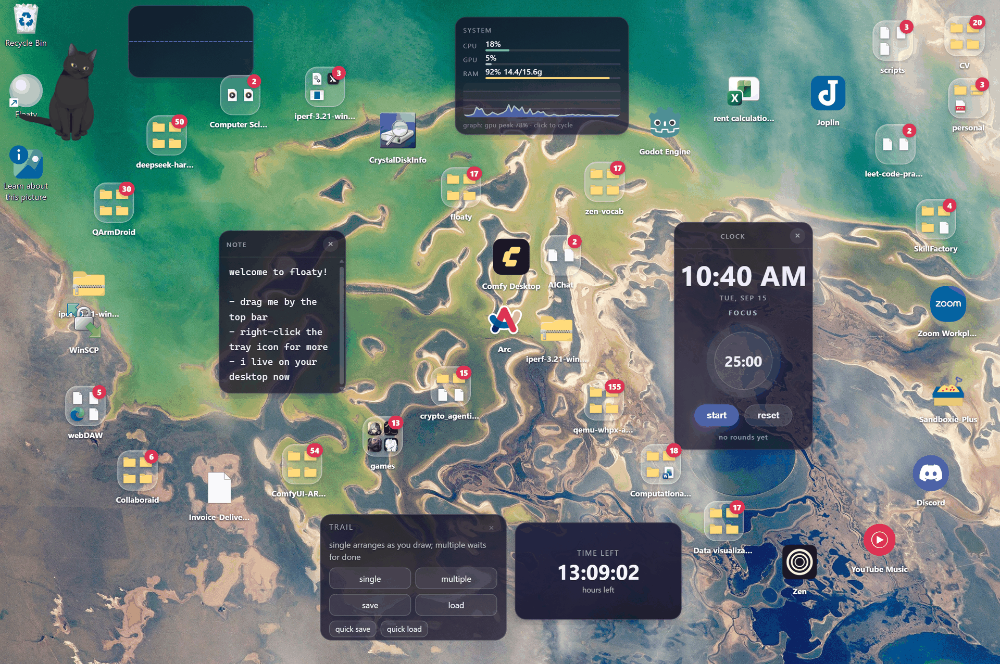

# Trail

Draw a path across the desktop and the app, file and folder icons line up along
it — evenly spaced, in order, and pinned where they land so the arrangement is
still there tomorrow.

Demo video: [`demos/trails/trails-demo.mp4`](../../../demos/trails/trails-demo.mp4)
(1440×960). This is the example to read if you want a plugin that *acts on the
desktop* rather than sitting on it; for a plain widget, read
[countdown](../countdown) first.

## Using it

Add it from **+ New floatie** → *+ trail*, or drop the folder into your plugins
folder (see the [examples README](../README.md)). It appears as a small panel
that you drag by its top bar, like any other floatie.

| Control | What it does |
| --- | --- |
| **single** | Every stroke is the instruction: the icons walk onto the path you just drew, and the surface stays open so the next stroke moves them again. |
| **multiple** | Draw as many paths as you like; nothing moves until you press **done**. |
| **done** / **esc** | Leave the surface and turn the panel back into a panel. In **multiple** nothing has moved until **done** (or Enter) arranges along every path; escape leaves without arranging anything. In **single** each stroke already arranged, so escape simply stops where you are. |
| **save** | Name the arrangement (`trail 1` by default — type over it, Enter keeps it, Escape drops it). The paths are stored in the widget's own record. |
| **load** | A page of nine slots: a picture of each arrangement above its name, a page box you can type into with arrows either side, and per-slot **✎** to rename it in place and **×** to forget it. |
| **quick save** / **quick load** | One unnamed slot, at each end of the same idea. |
| **×** (top right) | Remove the trail floatie. Right-click the panel for the standard menu — pin on top, remove. |

A stroke shorter than about 140px is read as a slip of the hand rather than a
path, and says so. A **load** works the icons out again by re-running the
arrangement on the saved paths, so a slot saved with twenty icons still means
something on a desktop with eighteen — and it picks up icons that did not exist
when you saved it.

The panel asks for a taller slot (182px) the first time it mounts, because the
quick save / quick load row needs the room; existing slots grow once and stay
grown.

## What to read in `index.js`

The file is long because the problem is. The parts worth stealing:

- **A mode is how a plugin gets the mouse.** Floaty makes the desktop
  click-through outside a widget's own rectangle, so "draw on the desktop" means
  the panel first *becomes* the monitor area: its slot is stretched with
  `api.setPos(..., {transient: true})`, the canvas is hung off `document.body` so
  nothing clips it, and the panel hides itself until the mode closes. The
  `transient` flag matters — a plain move is the widget's own place, and the
  position watcher would save the scaffolding over it.
- **Moving another floatie** is two calls and a refresh: `floaty_list` to read the
  desktop, `api.setPos` + `api.record.save` for each item, then `floaty_refresh`
  so the widgets already on screen re-read their records instead of carrying on
  falling. Coordinates are integers; the backend refuses a record carrying a
  float.
- **One gap for the whole run.** Icons are spaced evenly along the path (not by
  the room each pair's local direction wants), and the icons are shared between
  several trails by *length* — a trail's share of the icons is its share of the
  total length — which is what keeps the spacing on either side of a crossing
  identical.
- **`openMode(mode, {silent: true, paths})`** is the same code path a load uses:
  it skips the surface, the slot resize and the panel hiding, and arranges
  straight away.

[`docs/PLUGINS.md`](../../../docs/PLUGINS.md#reference-plugins) has the reasoning
behind each of those, including the four ways the arrangement was wrong first.
